# hse24_hw2
* Клеточная линия: BLaER1
* Гистоновая метка: H3K27me3
## FastQC
В папке data лежат html файлы, полученные после работы fastqc
### Контроль. Был подрезан для увеличения качества при помощи trimmomatic
Html файл до подрезания лежит в папке data
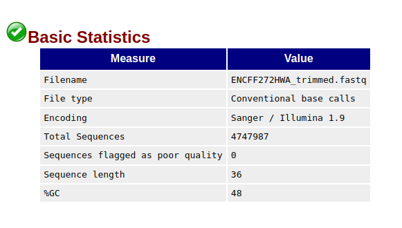
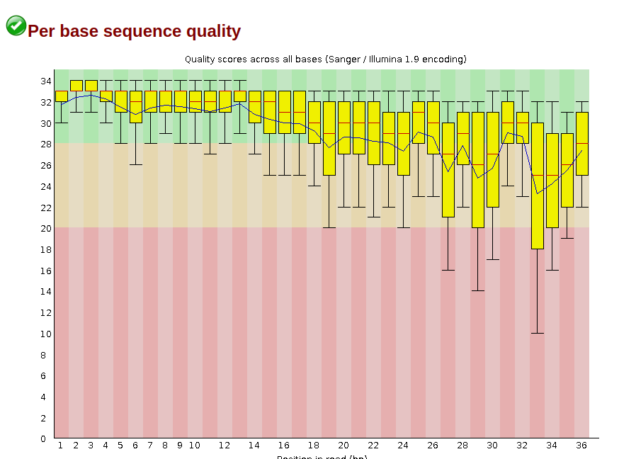
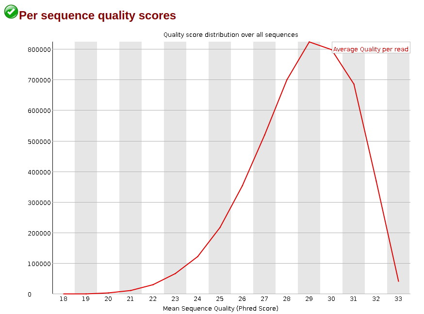
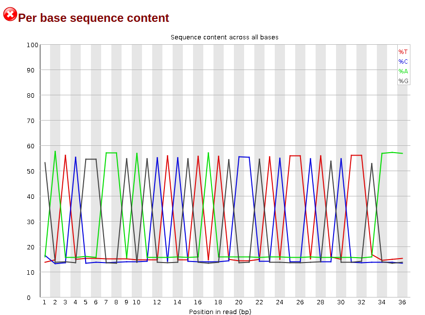
### 1 реплика. Была подрезана для увеличения качества при помощи trimmomatic
Html файл до подрезания лежит в папке data
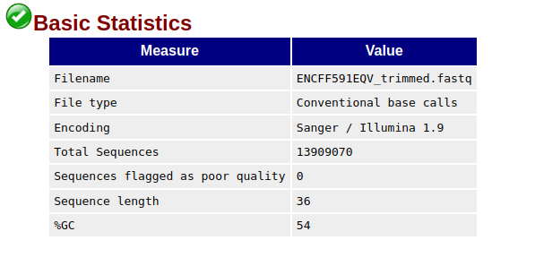
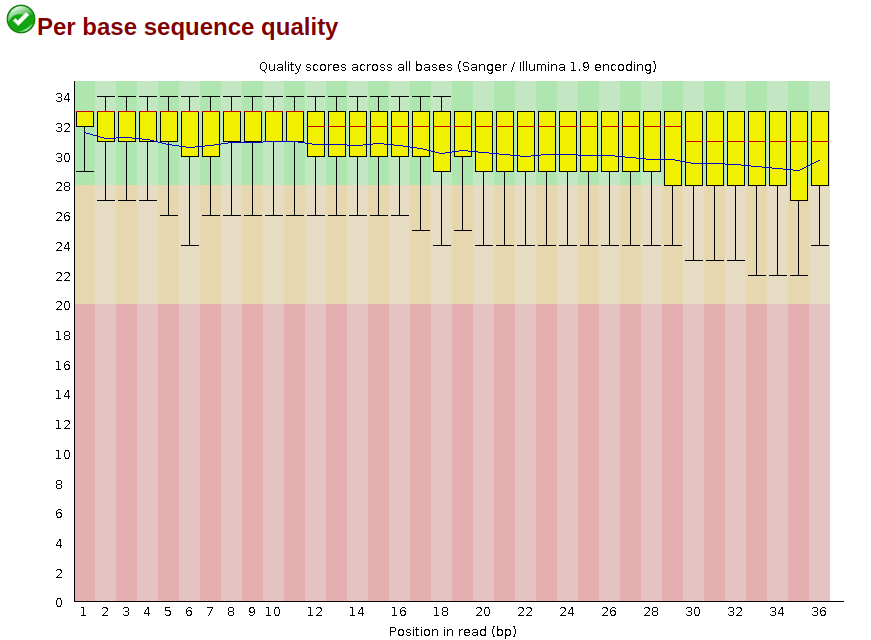
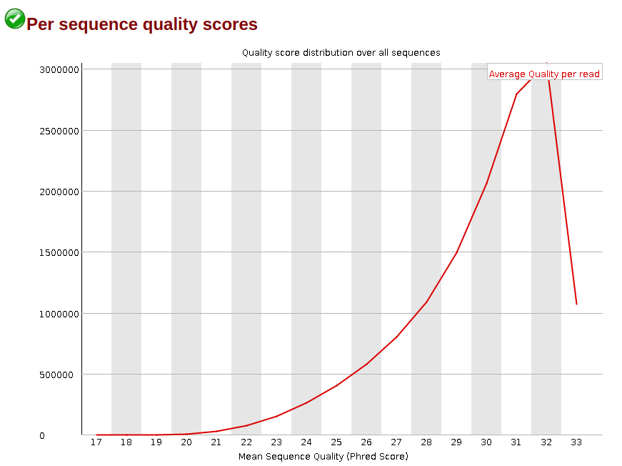
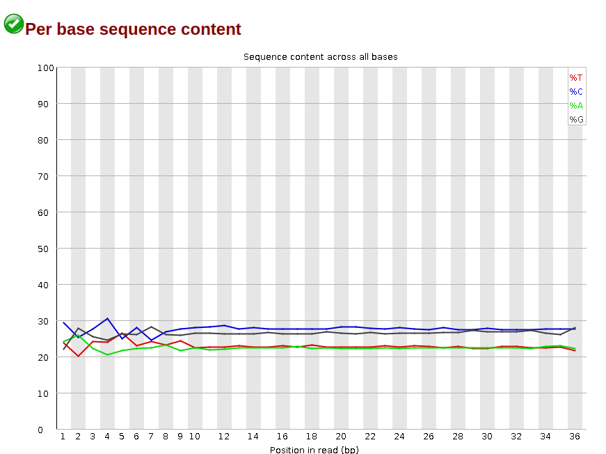
### 2 реплика
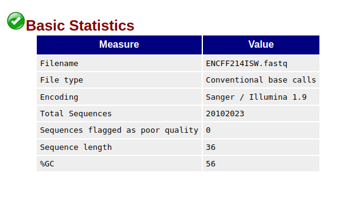
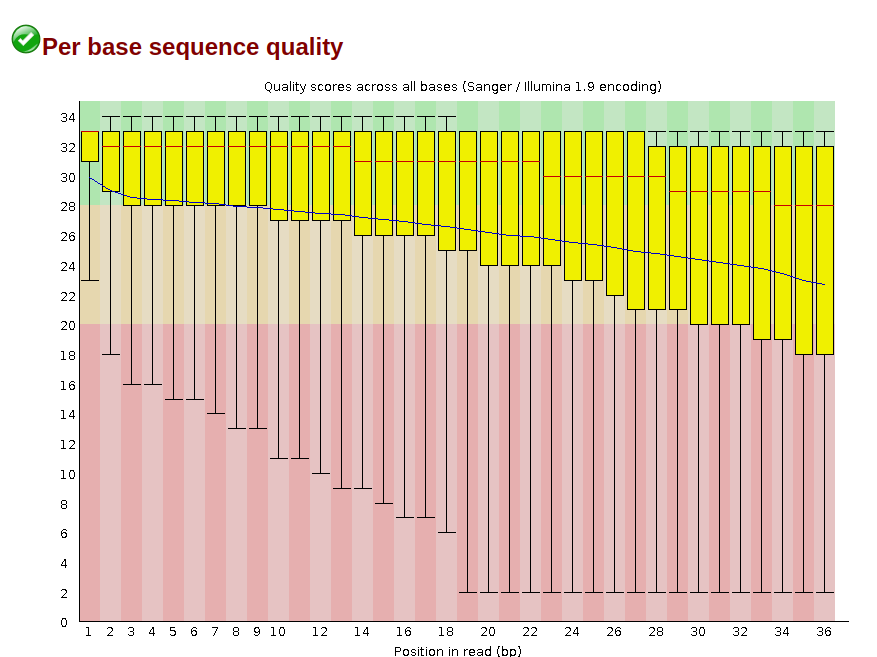
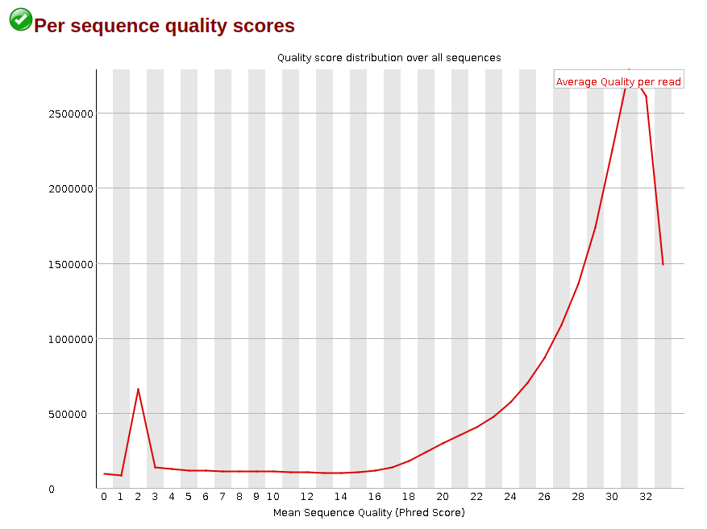
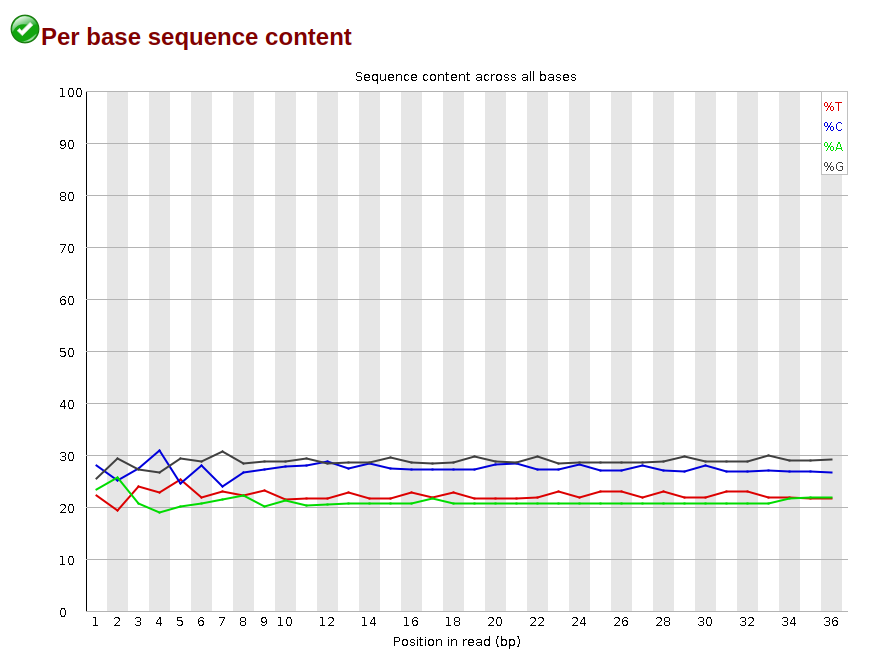
### Анализ
Все риды хорошего качества, так что дальнейшее подрезание не требуется
## Выравнивание по 17 хромосоме

| index                 | Сумма ридов | Кол-во уникально выровнявшихся | % уникально выровнявшихся | Кол-во неуникально выровнявшихся | % неуникально выровнявшихся | Кол-во не выровнявшихся | % не выровнявшихся |
|-----------------------|-------------|--------------------------------|---------------------------|---------------------------|-----------------------------|------------------|--------------------|
| ENCFF591EQV           | 20283316     | 874136                       | 4.31%                     | 600026                          | 2.96%                       | 18809154         | 92.73%             |
| ENCFF214ISW           | 20102023    | 908788                        | 4.52%                     | 602974                   | 3.00%                       | 18590261         | 92.48%             |
| ENCFF272HWA  |  7405920    | 156738                        | 2.12%                     | 570725                          | 7.71%                       | 6678457         | 90.18%             |

## Диаграммы Эйлера-Венна
### 1 реплика с ENCODE

### ENCODE с 1 репликой
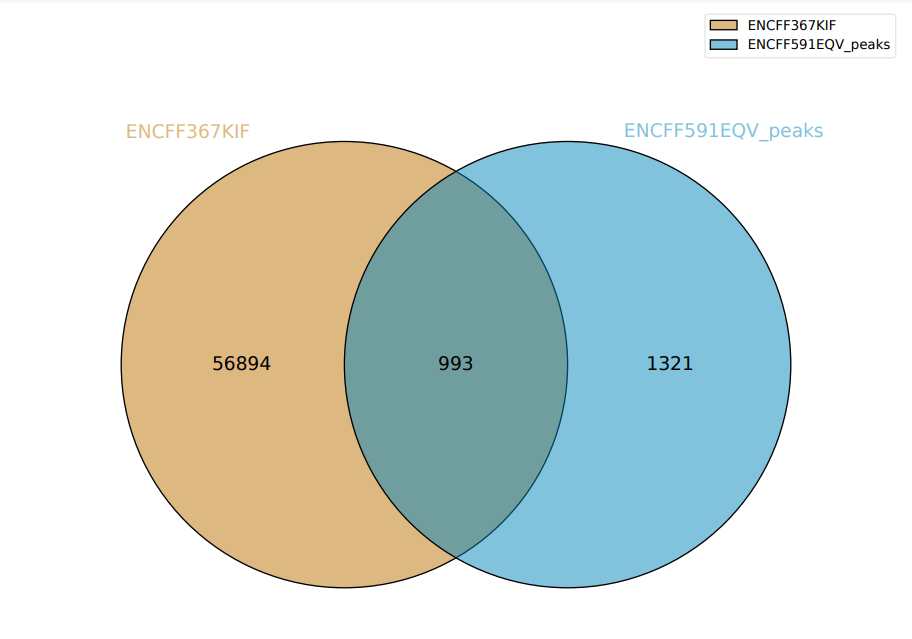
### 2 реплика с ENCODE
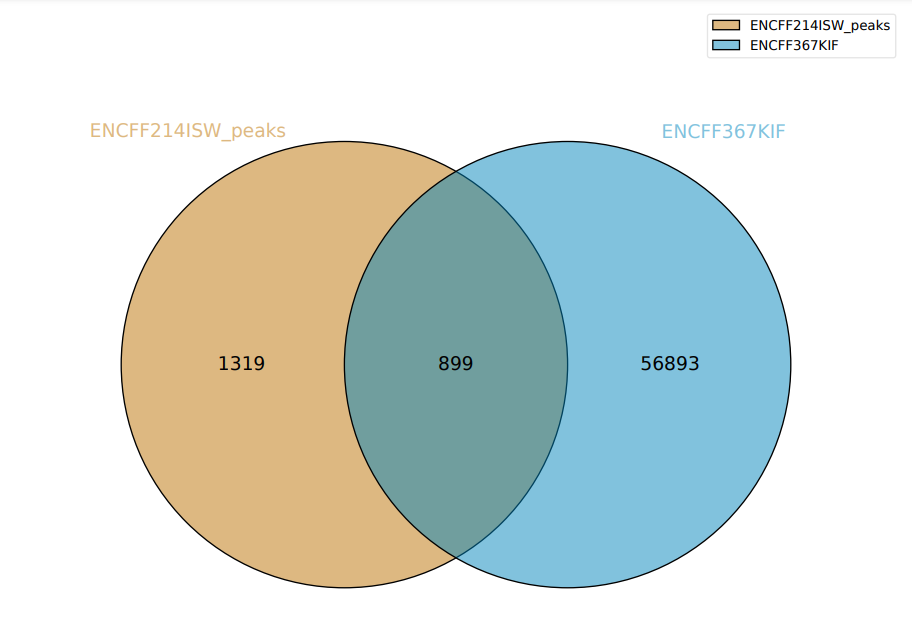
### ENCODE сo 2 репликой

### Анализ
Пересечений довольно мало. Это связано с тем, что в ENCODE пики для всех хромасом, поэтому их больше. Также пересечение нас с ENCODE и ENCODE с нами разные вещи, что подтверждают предоставленные изображения. Pdf файлы диаграмм можно найти в папке data. 